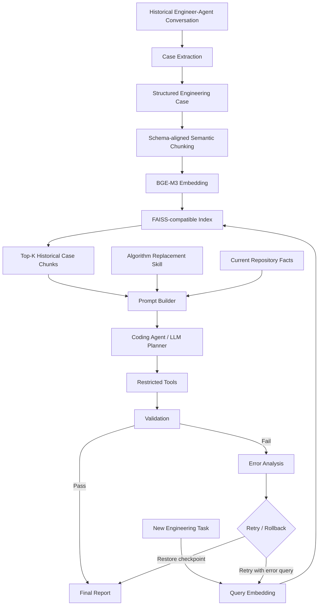

# 算法升级 RAG 代理演示

以“复杂算法系统中的单模块替换”为完整案例：从历史工程对话提取经验，
用 BGE-M3 检索，通过 DeepSeek 生成代码修改，执行并验证；失败后分析错误、
再次检索和修复，最终成功或回滚。数据、模型以及项目执行与验证均有替换接口。



## 快速开始

在仓库根目录运行，默认使用 DeepSeek + BGE-M3，并包含历史对话抽取：

```bash
python -m venv .venv
source .venv/bin/activate
pip install -r requirements.txt
# 首次填写自己的 API key；password.txt 已被 Git 忽略
cp .env.example password.txt
# 编辑 password.txt 中的 DEEPSEEK_API_KEY 后加载
source ./load_deepseek_env.sh
python -m algo_rag_demo.cli --config configs/deepseek_bge_m3.json run \
  --case-dir examples/custom_data/cases \
  --task-file examples/custom_data/task.txt \
  --repository-facts examples/custom_data/repository_facts.txt
```

也可以运行 `bash scripts/run_demo.sh`。首次需要下载 BGE-M3；
已有本地模型时可以通过 embedding 配置指向本地目录。

示例任务是将 LegacyRanker 替换为 NeuralScorer，保留下游接口与旧算法回退。
代理编辑运行目录中的项目副本。验证实际检查接口字段、算法启用、分数与排序、
空输入、旧算法回退。首次验证通过就结束；失败才进入错误检索和重试，
最多执行三轮，最终失败会回滚并以非零退出码结束。结果由实际模型输出与测试决定。

## 运行产物

```text
outputs/runs/<timestamp>-algorithm-upgrade-<id>/
  conversations/        本次历史对话
  cases/                LLM 抽取的结构化 Case
  knowledge/chunks.json
  index/                向量索引与元数据
  workspace/            实际修改和验证的项目副本
  checkpoint/           初始可编辑文件与恢复清单
  task.json
  attempts/01/
    query.json
    retrieval.json
    prompt.md
    plan.json
    execution.json
    validation.json
    error_analysis.json  仅失败轮次生成
  final_report.json      success / rolled_back / rollback_failed / failed
```

Top-K 排序单位是 Chunk，多个 Chunk 可能来自同一 Case；case_path、case_id 和
source 可以回溯 Case 与历史对话。Chunk 按 Case Schema 的任务、约束、解决方案分组，
不是额外使用一个 LLM 自动切分。

## 自定义数据与模型

历史对话和 Case 的设计方式、模型切换接口继续沿用。
自定义数据接入完整闭环时，还需配置自己的目标项目、可编辑文件与验证命令，
或实现 ProjectAdapter；见[执行与验证接口](docs/execution_validation.md)。
只检查数据检索与规划时可使用 `--plan-only`，仍调用配置中的 LLM 和 Embedding。

| 文档 | 内容 |
| --- | --- |
| [自定义数据到 Case](docs/03_architecture_for_reuse.md) | 历史对话、Schema、自动适配 |
| [执行与验证接口](docs/execution_validation.md) | 自定义工具、验证、重试和回滚 |
| [Case Schema](docs/case_schema.md) | EngineeringCase 字段 |
| [RAG Pipeline](docs/rag_pipeline.md) | Chunk、Embedding、索引与检索 |
| [命令手册](docs/commands.md) | 完整运行与单步命令 |
| [架构概览](docs/architecture.md) | 模块边界与替换接口 |

## 模型切换

LLM 配置在 configs/*.json，更换 OpenAI-compatible 服务只需修改
base_url、api_key_env 和 model：

```json
{"llm": {"provider": "deepseek", "base_url": "https://api.deepseek.com",
         "api_key_env": "DEEPSEEK_API_KEY", "model": "deepseek-flash"}}
```

Embedding 配置：

```json
{"embedding": {"provider": "bge-m3", "model": "BAAI/bge-m3"}}
```

自定义 Embedding 实现 EmbeddingProvider.encode_documents/encode_query，
在 get_embedding_provider() 注册。检索实现遵循 Retriever.search() 返回结构；
替换检索器后仍可复用 run_agent()。Mock 向量仅保留用于内部自动化测试。

## 项目目录

```text
algo_rag_demo/
  case_pipeline/  Conversation -> Case -> Chunk
  rag/            Embedding、Index、Retrieval、Prompt
  agent/          LLM、Planner、ProjectAdapter、闭环 Workflow
configs/          模型与执行配置
examples/
  custom_data/    历史对话、Case、任务与仓库事实
  algorithm_upgrade/  示例算法项目、独立验证与 Skill
docs/             接入文档
scripts/          一键运行入口
tests/            自动化测试
```

文件白名单约束代理的编辑入口，验证命令来自用户配置；这个执行器不是操作系统沙箱。
不可信代码可通过自己的 Adapter 在容器中执行。API key、password.txt、.env、
outputs 和缓存不提交到 GitHub。
