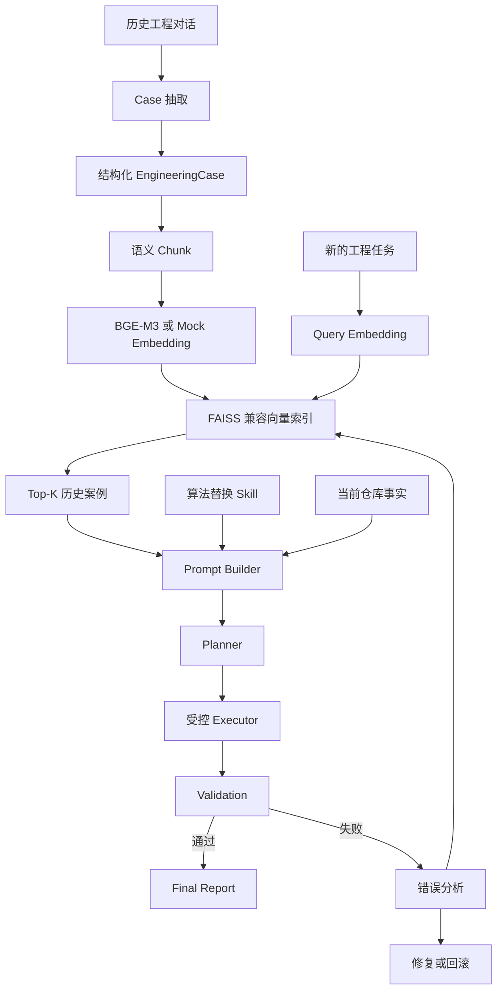

# 算法升级 RAG Agent Demo

这是一个面向教学和复用的工程示例项目，用来展示如何把历史工程对话沉淀为结构化 Case，再通过 RAG 检索、Planner 规划、Executor 执行和验证闭环，辅助完成复杂算法模块替换任务。

项目中的代码、数据、日志和配置都是合成示例，不包含真实业务数据或公司内部信息。

## 这个项目解决什么问题

复杂算法升级经常不是“改一个文件”就能完成。失败原因往往藏在下游接口、配置开关、验证标准、运行时依赖和回滚要求里。

这个 Demo 用一个简化场景说明：

```text
Input Image -> PreProcess -> DRE -> ColorTransform -> Output
```

旧算法 `OldDRE` 返回：

```python
{"image": ..., "residual_map": ..., "metadata": ...}
```

新算法 `NewLLF` 初始只返回：

```python
{"image": ..., "metadata": ...}
```

但下游 `ColorTransform` 仍然依赖 `residual_map`，所以 Agent 不能直接替换算法，而应该增加兼容适配层。

## 核心流程

```text
历史对话
-> LLM/规则抽取
-> 结构化 Case
-> Schema 对齐的 Chunk
-> Chunk Text Embedding
-> Vector Index
-> Query Retrieval
-> Prompt Builder
-> Planner 生成计划
-> Executor 执行
-> Validation 验证
-> 失败后用错误信息再次检索
-> 修复计划
-> 再执行
-> 成功或回滚
```

## 架构图



## 为什么要把 Case 和 Chunk 分开

原始历史对话里会有试错、重复上下文和临时错误结论。项目先把对话整理成统一的 `EngineeringCase`，再按固定 Schema 切成三类 Chunk：

- `task`：任务背景和目标
- `constraint`：约束、风险、接口要求
- `solution`：可复用解决方案

这样做的好处是：检索时不是把整段聊天粗暴向量化，而是让每个 Chunk 对齐工程知识点。查询“接口缺字段”时更容易命中 `constraint` 或 `solution`，查询“要替换算法”时更容易命中 `task`。

## 两种运行模式

### 1. Teaching Demo：低门槛讲解版

不需要 DeepSeek，不需要 BGE-M3，不需要网络，也不需要 API key。

```bash
python -m venv .venv
source .venv/bin/activate
pip install -r requirements-lite.txt
bash scripts/run_teaching_demo.sh
```

它使用：

- `MockEmbeddingProvider`
- `MockPlanner`
- `PlanExecutor`

适合第一次讲解项目整体链路。

### 2. Live Demo：真实集成版

使用 DeepSeek 做规划，使用 BGE-M3 做真实语义向量。

```bash
python -m venv .venv
source .venv/bin/activate
pip install -r requirements.txt
source ./load_deepseek_env.sh
bash scripts/run_live_demo.sh
```

这个模式需要：

- DeepSeek API key
- 网络访问
- BGE-M3 依赖和模型文件

本地可以创建 `password.txt` 保存环境变量，但它已经被 `.gitignore` 排除，不应该提交到 GitHub。

## 常用命令

构建索引：

```bash
python -m algo_rag_demo.cli build-index
```

检索历史案例：

```bash
python -m algo_rag_demo.cli search "Replace DRE while keeping downstream interface compatible"
```

运行失败恢复闭环：

```bash
python -m algo_rag_demo.cli demo-failure
```

运行测试：

```bash
python -m pytest -q
```

使用 DeepSeek 抽取 Case：

```bash
export DEEPSEEK_API_KEY="your_api_key"
export DEEPSEEK_BASE_URL="https://api.deepseek.com"
export DEEPSEEK_MODEL="deepseek-flash"
python -m algo_rag_demo.cli extract-case --extractor deepseek --raw examples/data/raw/conversation_dre_upgrade.json
```

## 运行后看什么

每次 demo 会在 `outputs/runs/<timestamp>/` 下写入结果：

```text
task.json
initial_retrieval.json
initial_plan.json
initial_execution.json
retrieval.json
plan.json
repair_execution.json
validation.json
final_report.json
```

最适合展示的是：

- `initial_retrieval.json`：第一次基于任务本身的检索
- `initial_execution.json`：第一次直接替换失败
- `retrieval.json`：基于错误信息的二次检索
- `plan.json`：修复计划
- `final_report.json`：最终验证结果

## 项目目录

```text
algo_rag_demo/      核心代码：Case pipeline、RAG、Agent、CLI
examples/           示例数据、示例工程、示例 Skill
docs/               教学版、真实集成版、复用架构说明
scripts/            一键运行脚本
tests/              单元测试和流程测试
outputs/            生成的索引和运行日志，不提交到 GitHub
```

## 代码边界

教学剧情放在：

```text
algo_rag_demo/demo_scenarios/dre_failure_recovery.py
```

可复用能力放在：

```text
algo_rag_demo/case_pipeline/
algo_rag_demo/rag/
algo_rag_demo/agent/
```

这样读者既可以快速看懂演示流程，也可以把 RAG、Planner、Executor、Validation 这些模块拆出来用到自己的工程里。

## 推荐阅读顺序

1. `docs/01_teaching_demo.md`：无 API、无网络的教学 Demo。
2. `docs/02_live_deepseek_bge.md`：DeepSeek + BGE-M3 真实集成。
3. `docs/03_architecture_for_reuse.md`：如何复用到自己的项目。

## 5 分钟展示路线

1. 打开 `examples/data/raw/conversation_dre_upgrade.json`，说明历史对话不是直接拿来检索。
2. 打开 `examples/data/cases/CASE_DRE_001.json`，说明对话会变成结构化 Case。
3. 打开 `examples/data/knowledge/chunks.json`，说明 Chunk 与 Case Schema 对齐。
4. 运行 `python -m algo_rag_demo.cli search "Replace DRE while keeping downstream interface compatible"`。
5. 运行 `python -m algo_rag_demo.cli demo-failure`。
6. 打开最新的 `outputs/runs/.../final_report.json`，展示接口、构建、运行、算法切换和回滚验证。

## 检索排序示例

项目内置了多个相近 Case，方便观察 RAG 排序：

```bash
python -m algo_rag_demo.cli search "missing metadata algorithm runtime evidence"
python -m algo_rag_demo.cli search "pipeline json still selects old algorithm rollback"
python -m algo_rag_demo.cli search "DRE missing residual_map interface error"
```
