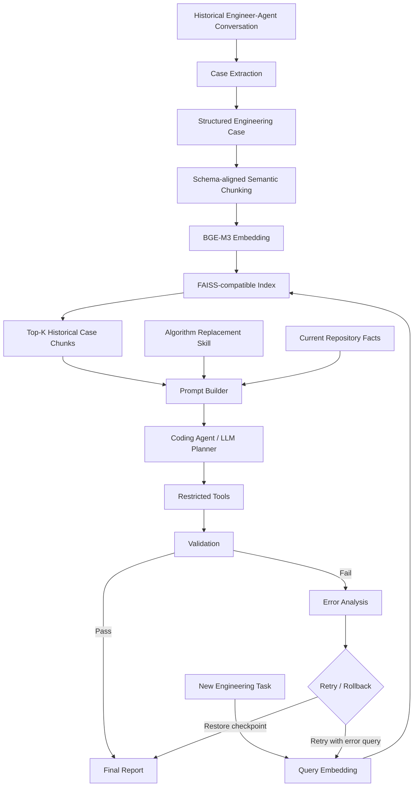

# 演示demo任务介绍

以“复杂算法系统中的单模块替换”为完整案例：从历史工程对话提取经验，
用 BGE-M3 检索，通过 DeepSeek 生成代码修改，执行并验证；失败后分析错误、
再次检索和修复，最终成功或回滚。数据、模型以及项目执行与验证均有替换接口。



## 示例任务

将 LegacyRanker 替换为 NeuralScorer，保留下游接口与旧算法回退。
代理编辑运行目录中的项目副本。验证实际检查接口字段、算法启用、分数与排序、
空输入、旧算法回退。首次验证通过就结束；失败才进入错误检索和重试，
最多执行三轮，最终失败会回滚并以非零退出码结束。结果由实际模型输出与测试决定。

| 输入 | 位置与作用 |
| --- | --- |
| 历史对话 | examples/custom_data/raw/，供 LLM 抽取工程经验 |
| 结构化 Case 模板 | examples/custom_data/cases/，展示 EngineeringCase 的字段结构 |
| 新工程任务 | examples/custom_data/task.txt |
| 当前仓库事实 | examples/custom_data/repository_facts.txt |
| 目标示例项目 | examples/algorithm_upgrade/，复制到运行目录后修改和验证 |
| Algorithm Replacement Skill | examples/algorithm_upgrade/skill.md |
| 模型与执行配置 | configs/deepseek_bge_m3.json |

默认快速开始会从历史对话重新抽取 Case，使用 DeepSeek 和 BGE-M3 完成闭环。
运行命令见 [README 快速开始](../README.md#快速开始)。

## 运行产物

```text
outputs/runs/<timestamp>-algorithm-upgrade-<id>/
  conversations/        本次历史对话
  cases/                LLM 抽取的结构化 Case
  knowledge/chunks.json
  index/                向量索引与元数据
  workspace/            实际修改和验证的项目副本
  checkpoint/           初始可编辑文件与恢复清单
  task.json
  attempts/01/
    query.json
    retrieval.json
    prompt.md
    plan.json
    execution.json
    validation.json
    error_analysis.json  仅失败轮次生成
  final_report.json      success / rolled_back / rollback_failed / failed
```

Top-K 排序单位是 Chunk，多个 Chunk 可能来自同一 Case；case_path、case_id 和
source 可以回溯 Case 与历史对话。Chunk 按 Case Schema 的任务、约束、解决方案分组，
不是额外使用一个 LLM 自动切分。

## 查看运行结果

先看 final_report.json，确认最终状态和执行轮次。
每轮的 query.json 与 retrieval.json 展示检索输入和排序；
prompt.md 与 plan.json 展示模型上下文、计划及修改动作；
execution.json 与 validation.json 展示执行记录、真实测试退出码及输出。
验证失败时还会保存 error_analysis.json，下一轮结合错误信息重新检索与规划。

需要换成自己的数据和目标项目时，参见[自定义数据到 Case](03_architecture_for_reuse.md)
和[执行与验证接口](execution_validation.md)。
