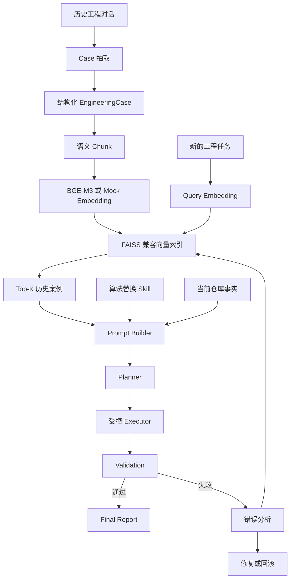

# 项目背景与问题

复杂算法升级经常不是“改一个文件”就能完成。失败原因往往藏在下游接口、配置开关、验证标准、运行时依赖和回滚要求里。

这个 Demo 用一个简化场景说明：

```text
Input Image -> PreProcess -> DRE -> ColorTransform -> Output
```

旧算法 `OldDRE` 返回：

```python
{"image": ..., "residual_map": ..., "metadata": ...}
```

新算法 `NewLLF` 初始只返回：

```python
{"image": ..., "metadata": ...}
```

但下游 `ColorTransform` 仍然依赖 `residual_map`，所以 Agent 不能直接替换算法，而应该增加兼容适配层。

## 完整链路

```text
历史对话
-> LLM/规则抽取
-> 结构化 Case
-> Schema 对齐的 Chunk
-> Chunk Text Embedding
-> Vector Index
-> Query Retrieval
-> Prompt Builder
-> Planner 生成计划
-> Executor 执行
-> Validation 验证
-> 失败后用错误信息再次检索
-> 修复计划
-> 再执行
-> 成功或回滚
```

## 架构图



## 为什么不是简单搜索

原始历史对话里会有试错、重复上下文和临时错误结论。项目先把对话整理成统一的 `EngineeringCase`，再按固定 Schema 切成 `task`、`constraint`、`solution` 三类 Chunk。

这样做的好处是：检索时不是把整段聊天粗暴向量化，而是让每个 Chunk 对齐工程知识点。查询“接口缺字段”时更容易命中 `constraint` 或 `solution`，查询“要替换算法”时更容易命中 `task`。
